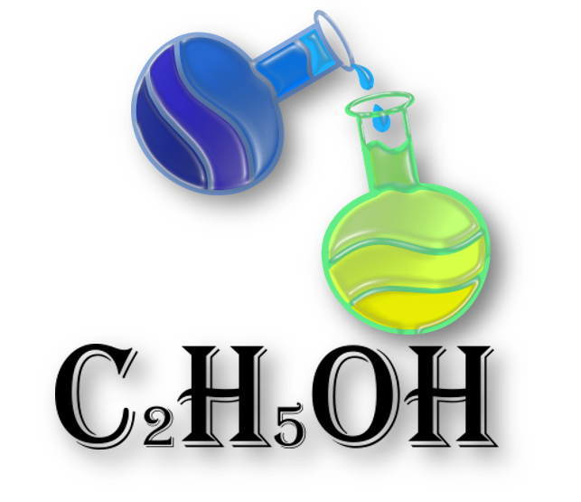

 
  
  <h1>📖 Description </h1>
  C2H5OH is our team name. Our goal is to create a game about Chemistry and Biology
  <h1>👥 Our Team </h1>
  

  
1. **Stiliyan Mishev** - **Scrum trainer**	
   > ***GitHub profile***: [***SMMishev21***](https://github.com/SMMishev21)	

2. **Ivailo Bachvarov** - **Backend Developer** 
   > ***GitHub profile***: [***ISBachvarov21***](https://github.com/ISBachvarov21)	

3. **Martin Velkov** - **Backend Developer** 
   > ***GitHub profile***: [***MVVelkov21***](https://github.com/MVVelkov21)	

4. **Nikola Paskov** - **Designer** 
   > ***GitHub profile***: [***NTPaskov21***](https://github.com/NTPaskov21)

  

  
  <h1>🌐💻 Used technologies</h1>
  
 
	
	<a> 
	
   
	
	
	

  

	
   
   <h1>📋 Documents</h1>
  

 <h2> <a href ="https://github.com/SMMishev21/C2H5OH/blob/main/Documents/Documentation.C2H5OH.docx" >📜 Documentation</h2>
 <h2> <a href ="https://github.com/SMMishev21/C2H5OH/blob/main/Documents/Presentation.C2H5OH.pptx" >📰 Presentation</h2>

## ***If you like our game you can give us a 🥇***